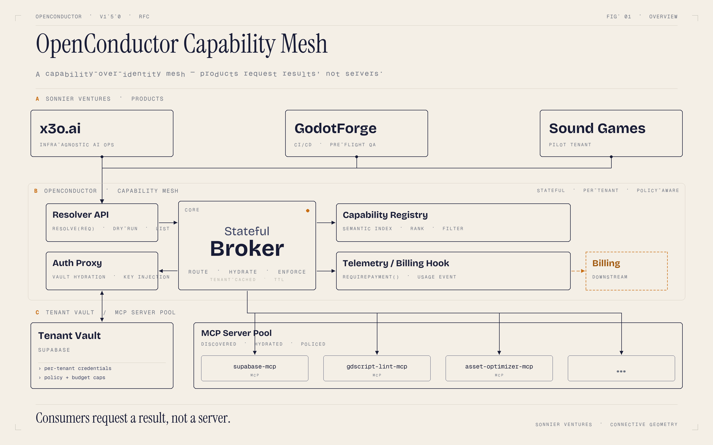
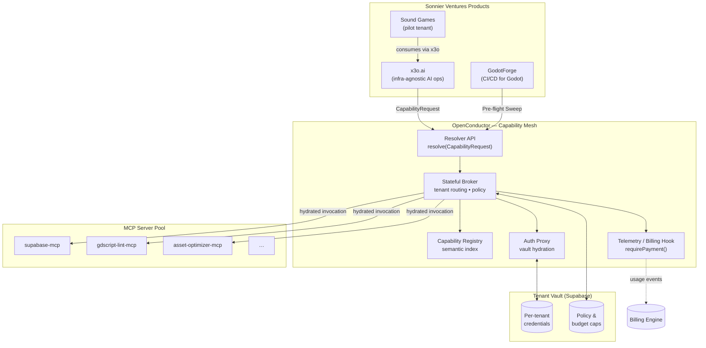
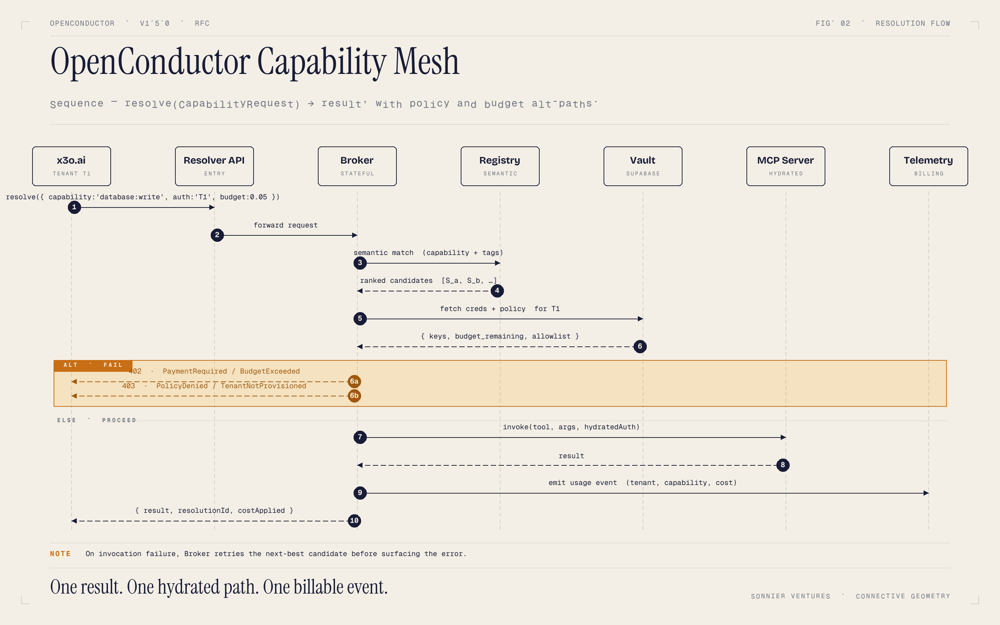
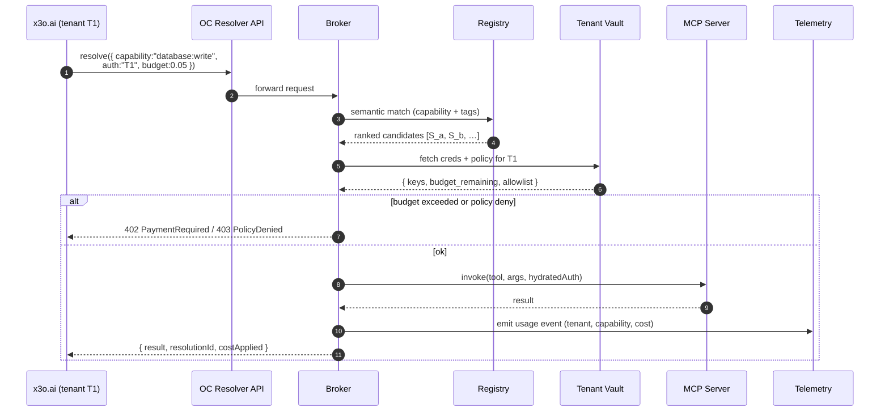

# OpenConductor Architecture — Capability Mesh (v1.5.0)

> **Status:** Draft / RFC
> **Audience:** Sonnier Ventures collaborators (x3o.ai, GodotForge, Sound Games)
> **Owner:** Chairman / SDK maintainers

---

## 1. Why this shift

OpenConductor today is a **static SDK + discovery layer**. Clients hard-code MCP endpoints:

```ts
openconductor.connect("https://api.supabase-mcp.io")
```

This forces every consuming product (x3o.ai, GodotForge) to know *which server* does *which job*, manage its own credentials, and re-implement tenant routing.

The v1.5.0 refactor moves OpenConductor from **Static Discovery** to **Just-In-Time (JIT) Provisioning** — a *Capability Mesh* where consumers request a **result**, not a server.

```ts
openconductor.resolve({
  capability: "database:write",
  auth: "tenant_id_123",
  budget: 0.05,
})
```

This makes OpenConductor the **router** — the connective tissue between Sonnier Ventures products and the MCP ecosystem.

---

## 2. High-level architecture



> Rendered from the Mermaid source below. To regenerate the PNG after editing, run `python docs/architecture/_render.py`. Design philosophy: [Connective Geometry](architecture/design-philosophy.md).



**Key idea:** consumers never touch a raw MCP URL. The Broker resolves capability → server, hydrates credentials from the tenant vault, enforces budget/policy, and emits a billable telemetry event on success.

---

## 3. Resolution sequence (x3o.ai → Broker → MCP)



> Rendered from the Mermaid sequence below. Failure branches (`6a`, `6b`) are amber-dashed; the happy path resumes after the `ELSE · PROCEED` rule.



Failure modes worth calling out:
- **No candidate** → `CapabilityUnavailableError` (registry miss)
- **All candidates over budget** → `BudgetExceededError`
- **Vault miss** → `TenantNotProvisionedError` (auto-onboarding hook fires here)
- **Server invocation failure** → Broker retries the next-best candidate before surfacing the error

---

## 4. `CapabilityRequest` schema

Lives in a new module: `@openconductor/mcp-sdk/resolve`. Built on the SDK's existing Zod stack.

```ts
import { z } from "@openconductor/mcp-sdk/validate"

export const CapabilityRequest = z.object({
  // What the caller needs done — namespaced verb (resource:action)
  capability: z.string().regex(/^[a-z0-9_-]+:[a-z0-9_-]+$/),

  // Tenant identity — Broker uses this to look up creds + policy
  auth: z.string().min(1),

  // Optional — guides semantic match and ranking
  tags: z.array(z.string()).optional(),
  description: z.string().optional(),

  // Cost ceiling for this single resolution, in USD
  budget: z.number().nonnegative().optional(),

  // Caller-supplied correlation id (traces across products)
  traceId: z.string().uuid().optional(),

  // Hard requirements — Broker filters candidates that fail these
  constraints: z.object({
    region: z.enum(["us", "eu", "global"]).optional(),
    compliance: z.array(z.enum(["soc2", "hipaa", "gdpr"])).optional(),
    maxLatencyMs: z.number().int().positive().optional(),
  }).optional(),
})

export type CapabilityRequest = z.infer<typeof CapabilityRequest>

export const CapabilityResponse = z.object({
  resolutionId: z.string().uuid(),
  serverId: z.string(),
  result: z.unknown(),
  costApplied: z.number().nonnegative(),
  latencyMs: z.number().int().nonnegative(),
})

export type CapabilityResponse = z.infer<typeof CapabilityResponse>
```

Capability strings are namespaced (`database:write`, `lint:gdscript`, `asset:optimize`) so the registry can do prefix matching and allow consumers to request *families* (`database:*`).

---

## 5. Broker contract

```ts
export interface Broker {
  // Primary entry point — what x3o.ai / GodotForge call
  resolve(req: CapabilityRequest): Promise<CapabilityResponse>

  // Streaming variant for long-running capabilities (e.g. asset optimization)
  resolveStream(req: CapabilityRequest): AsyncIterable<CapabilityChunk>

  // Introspection — what *could* this tenant do right now?
  // Useful for x3o.ai UI to render available actions per tenant
  list(tenantId: string, filter?: { tag?: string }): Promise<CapabilityDescriptor[]>

  // Pre-flight: can this resolve without actually invoking?
  // GodotForge uses this to validate a build plan before kickoff
  dryRun(req: CapabilityRequest): Promise<{
    candidates: CapabilityDescriptor[]
    estimatedCost: number
    blockers: string[]
  }>
}

export interface CapabilityDescriptor {
  capability: string
  serverId: string
  costPerCall: number
  tags: string[]
  compliance: string[]
}
```

The Broker is **stateful per tenant** — it caches policy/credentials with a short TTL to avoid hammering the vault on every call, and invalidates on policy change.

---

## 6. SDK module layout (v1.5.0)

```
@openconductor/mcp-sdk/
├── config/        # existing — init + demo mode
├── errors/        # existing  + new: CapabilityUnavailableError, BudgetExceededError, TenantNotProvisionedError
├── validate/      # existing — Zod re-export, used by resolve/
├── logger/        # existing
├── server/        # existing — wrapTool, healthCheck
├── telemetry/     # existing  + new: resolution events feed into Broker telemetry
├── payment/       # existing — requirePayment() now triggered by Broker on resolve()
├── resolve/       # NEW — CapabilityRequest schema, client.resolve()
├── broker/        # NEW — Broker interface + reference impl
├── registry/      # NEW — semantic index + ranking
└── auth-proxy/    # NEW — vault hydration, credential injection
```

Existing modules stay backward-compatible; `resolve/` is purely additive in v1.5.0.

---

## 7. GodotForge "Pre-Flight" integration

Before a Godot build runs, GodotForge issues a discovery sweep. This is just a `dryRun` over the static-analysis capabilities:

```ts
const sweep = await openconductor.broker.dryRun({
  capability: "lint:gdscript",
  auth: tenantId,
  tags: ["pre-build", "fast"],
})

if (sweep.blockers.length) {
  fail(`Pre-flight blocked: ${sweep.blockers.join(", ")}`)
}

for (const cap of sweep.candidates) {
  await openconductor.broker.resolve({
    capability: cap.capability,
    auth: tenantId,
  })
}
```

This is the wedge for the Sound Games pilot — the "AI-Enhanced Guardrail" tier sells `dryRun` + automated remediation, not just CI minutes.

---

## 8. Open questions

- **Registry source of truth:** start with a static JSON in this repo, or stand up `openconductor-registry` (already exists) as the canonical store from day one?
- **Streaming protocol:** SSE vs. WebSocket vs. MCP-native streaming for `resolveStream`?
- **Multi-tenant fairness:** do we need per-tenant rate limits at the Broker, or push that to the underlying MCP servers?
- **Failover policy:** automatic retry on next-best candidate is convenient but can mask cost surprises — should it be opt-in via a `constraints.failover: true` flag?

---

## 9. Next steps

1. Land this RFC in `docs/` and circulate to Sound Games / GodotForge collaborators.
2. Implement `resolve/` and `broker/` skeleton in `src/` behind a feature flag (`OPENCONDUCTOR_MESH=1`).
3. Wire one capability end-to-end as a vertical slice: `database:write` via the existing supabase MCP, hydrated from a Supabase tenant vault.
4. Add a Telemetry event type `capability.resolved` and pipe it to the billing engine.
5. Export the polished diagram (canvas-design) for the collaborator deck once the RFC is approved.
